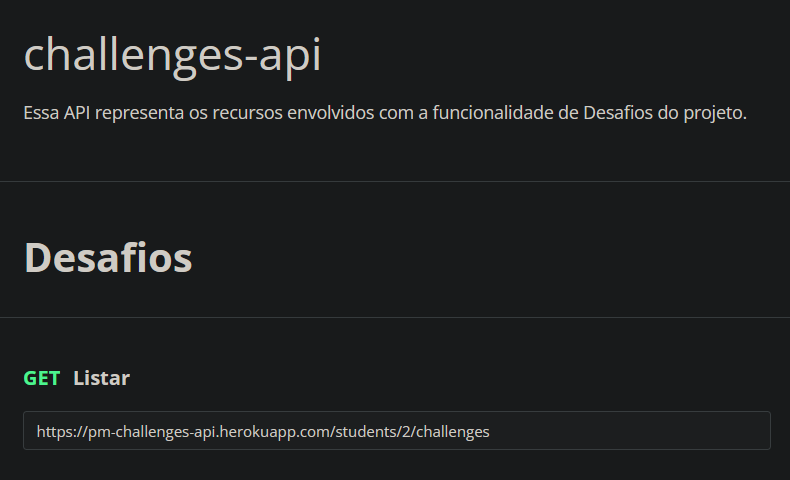
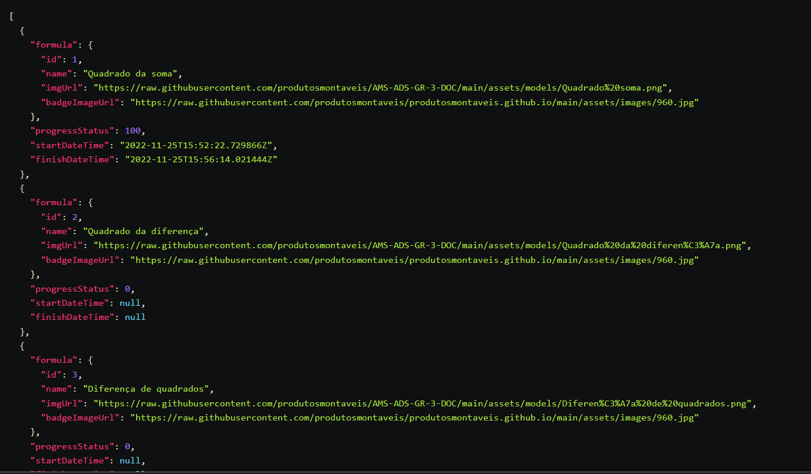
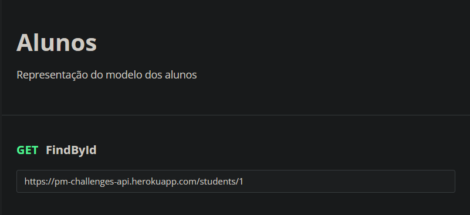
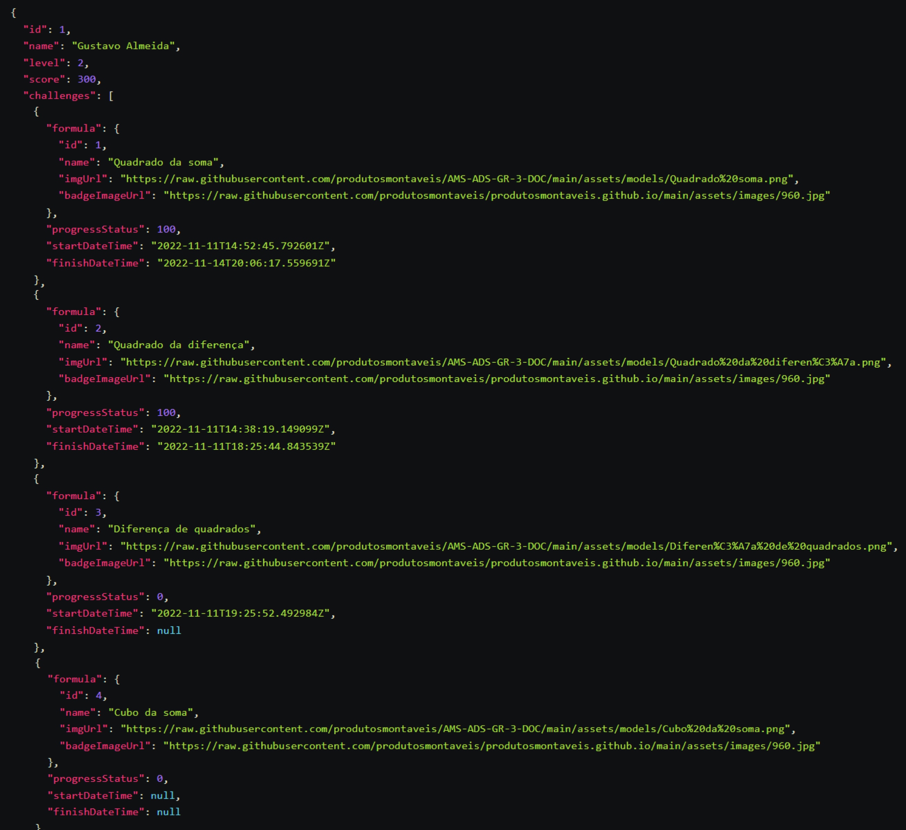
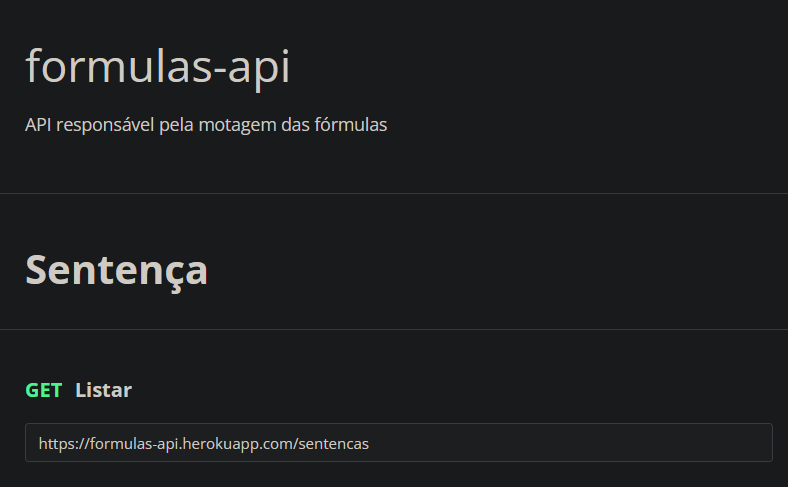
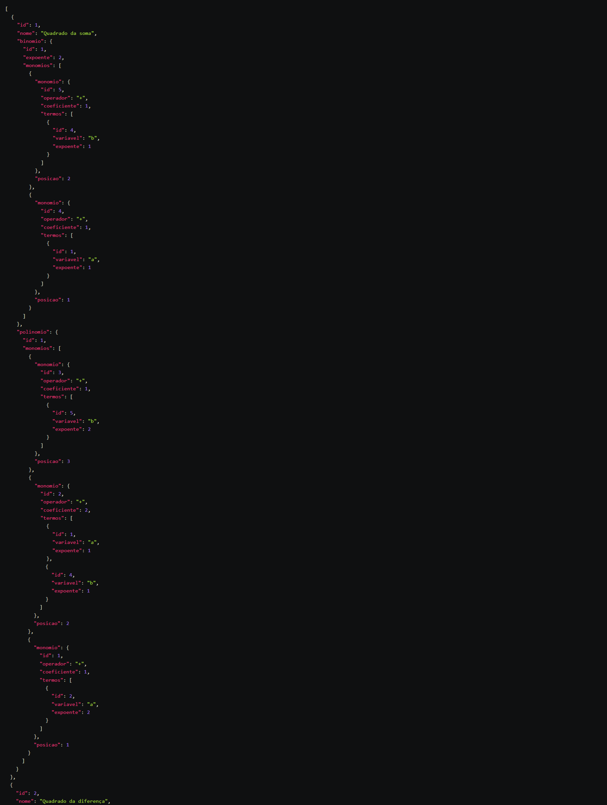

# Produtos Montáveis - Documentação

  

  <h3>Matemática que se vê</h3>

  

    Repositório para documentação do projeto.
  

    <a href="https://raw.githubusercontent.com/produtosmontaveis/AMS-ADS-GR-3-DOC/main/documents/v07_Documenta%C3%A7%C3%A3o.pdf"><strong>Ver o documento em pdf »</strong></a>

## Histórico da Revisão

|    Data    | Versão |                             Descrição                              |                          Autor(es)                          |
| :--------: | :----: | :----------------------------------------------------------------: | :---------------------------------------------------------: |
| 03/06/2022 |   V1   |                        Criação do Documento                        |                   Prof. Carlos Veríssimo                    |
| 10/06/2022 |   V2   | Definição de papéis dos integrantes da equipe e modelo de negócios | Gustavo Almeida Carvalho e Pedro Henrique Peruzzi Vanderlei |
| 24/06/2022 |   V3   |           Situação problema e tecnologias e ferramentas            | Gustavo Almeida Carvalho e Pedro Henrique Peruzzi Vanderlei |
| 31/07/2022 |   V4   |                             Protótipos                             | Gustavo Almeida Carvalho e Pedro Henrique Peruzzi Vanderlei |
| 16/09/2022 |   V5   |                   Replanejamento dos requisitos                    | Gustavo Almeida Carvalho e Pedro Henrique Peruzzi Vanderlei |
| 28/10/2022 |   V6   |                             Diagramas                              | Gustavo Almeida Carvalho e Pedro Henrique Peruzzi Vanderlei |
| 18/11/2022 |   V7   |                      Continuação e melhorias                       |                  Gustavo Almeida Carvalho                   |

## Identificação da Equipe

Id da Equipe: Produtos Montáveis

|  Prontuário   |               Nome               |          Papel          |
| :-----------: | :------------------------------: | :---------------------: |
| 1681432212003 | Pedro Henrique Peruzzi Vanderlei | Gerente de Projeto, Dev |
| 1681432212019 |     Gustavo Almeida Carvalho     | Scrum Master, DBA, Dev  |
| 1681432212024 |  Nathan Morais Adriano da Silva  |       Dev: mobile       |
| 1681432212026 |     João Gabriel Ávila Ruiz      |        Dev: Web         |
| 1681432212010 |   Yago Cauan de Oliveira Silva   |           Dev           |

## Documentação de API

A documentação das APIs foram feita pelo Postman, uma alternativa mais simples, porém não não efetiva quanto documentações do Swagger. No entanto, é esperado que em uma futura versão, as equipes façam a documentação pelo Swagger, de forma que futuras atualizações sejam documentadas mais rapidamente, além da possibilidade de interação com a API, recurso esse que essa documentação não possui.

### API de desafios

A API de desafios atua como a aplicação fundamental do sistema é responsável por criar uma conta simples para o aluno utilizá-lo e gerenciar os desafios associados aos alunos, bem como mostrar seus respectivos badges(emblemas). Os desafios de um aluno são criados juntamente com a criação do próprio aluno. Os principais endpoints servem para inciar, atualizar o progresso e encerrar um desafio.

A documentação completa encontra-se nesse [link](https://documenter.getpostman.com/view/19837990/2s8YsryEEU).

### [API de fórmulas

A API de fórmulas fornece informações sobre as fórmulas completas que o sistema utiliza, de modo que cada recurso que necessite das fórmulas completas a utilizem. Além disso, a API também possui suporte para a criação completa de novas fórmulas, seguindo o padrão matemático de equações.

A documentação completa encontra-se nesse [link](https://documenter.getpostman.com/view/19837990/2s8YsryEJv).

