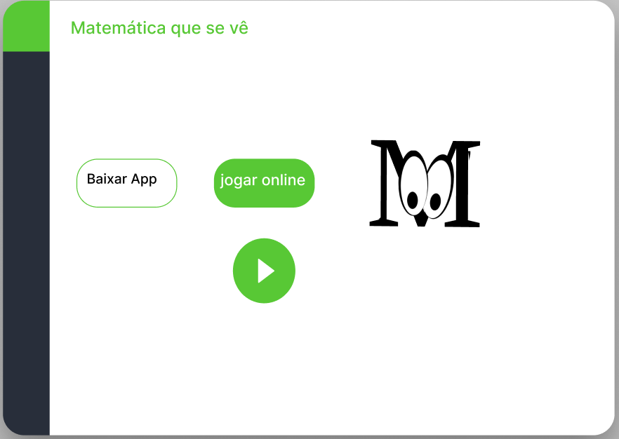

# Produtos Montáveis - Documentação

## Histórico da Revisão

| Data | Versão | Descrição | Autor(es) |
| :---: | :-----: | :-------: | :-------: |
| 03/06/2022 | V1 | Criação do Documento | Prof. Carlos Veríssimo |
| 10/06/2022 | V2 | Definição de papéis dos integrantes da equipe | Gustavo Almeida Carvalho e Pedro Henrique Peruzzi Vandellei |

## Identificação da Equipe

Id da Equipe: Produtos Montáveis

| Prontuário | Nome | Papel |
| :---: | :-----: | :-------: |
| 1681432212003 | Pedro Henrique Peruzzi Vanderlei | Gerente de Projeto, Dev
| 1681432212019 | Gustavo Almeida Carvalho | Scrum Master, DBA, Dev
| 1681432212024 | Nathan Morais Adriano da Silva | Dev: mobile
| 1681432212026	| João Gabriel Ávila Ruiz |	Dev: Web
| 1681432212010	| Yago Cauan de Oliveira Silva | Dev

## 1 Descrição Geral do Cliente

### 1.1 Descrição da Necessidade

<table>
    <tr>
        <td> A necessidade </td>
        <td> Apoio em tarefas acadêmicas e administrativas relativas à disciplina </td>
    </tr>
    <tr>
        <td> Afeta </td>
        <td> Docentes e discentes da Fatec </td>
    </tr>
        <td> O seu impacto é </td> 
        <td> Condução da disciplina, do ponto de vista acadêmico e administrativo </td>
    </tr>
    <tr>
        <td> Benefícios com a solução </td>
        <td> Proporcionar ao docente a utilização mais otimizada do tempo; maior transparência na relação doscente/discente; melhora na comunicação entre docente/discente </td>
    </tr>
</table>

### 1.2 Objetivo

Proporcionar a demonstração prática de conceitos matemáticos

### 1.3 Escopo

- Gestão de fórmulas algébricas
- Gestão de elementos gráficos
- Desafio: O usuário manipula as figuras baseado na expressão algébrica
- Demonstrar graficamente os conceitos, tendo como base as expressões algébricas
- Associar os elementos gráficos à elementos algébricos
- Mapear os passos de cada demonstração 
- Proporcionar fases no processo de aprendizado (performance do aluno)
- Análise de resultado

## 2 Descrição dos Gestores e dos Usuários

Representante: _Profa. Adriane_  
Função/Unidade: _Diretoria da Fatec São Caetano do Sul_  
Papel: _Stakeholder Principal_  

Representante: _Prof. Jacinto_  
Função/Unidade: _Coordenador do curso AMS-ADS - Fatec São Caetano do Sul_  
Papel: _Stakeholder_  

Representante: _Prof. Ayton Barboni_  
Função/Unidade: _Professor de Matemática da Fatec São Paulo_  
Papel: _Cliente_  

Representante: _Prof. Carlos Veríssimo_  
Função/Unidade: _Professor da disciplina Técnicas Avançadas de Programação Web e Mobile_  
Papel: _Cliente_  

## 3 Requisitos do Cliente

Deverão ser desenvolvidas funcionalidades para atender às seguintes necessidades de negócio

### 3.1 Requisitos Funcionais

*RF1:* Manutenção das fórmulas algébricas.

*RF2:* Manutenção dos elementos gráficos.

*RF3:* Manipulação das figuras com base na expressão algébrica.

*RF4:* Demonstração gráfica dos conceitos. 

*RF5:* Desafios: Usuário distribui as figuras para provar a teoria. 

*RF6:* Para cada demonstração gráfica, mostrar os conceitos matemáticos envolvidos. 

*RF7:* Prever níveis de maturidade do aluno. 

*RF8:* Proporcionar análise de desempenho dos alunos.

*RF9:* Sistema deve mostrar o desempenho do usuário a ele.

### 3.1 Requisitos Não Funcionais 

*RNF1:* Deverá atender às plataformas Web e Mobile.

*RNF2:* Deverá ser projeto utilizando a unidade Fatec São Caetano do Sul, porém com vista à atender à todas as unidade da Fatec (Nível Estadual). 

*RNF3:* Deverá ser desenvolvida um back-end robusto para dar sustentação (negócio) ao front-end (Mobile). 

*RNF4:* Todas as funcionalidades de CRUD deverão ser desenvolvidas na plataforma Web. 

*RNF5:* Design de ícones familiares com seu uso, para reconhecimento imediato. 

*RNF6:* Terá uma interface de fácil uso tanto para usuários experientes como para leigos. 

*RNF7:* O desenvolvimento do software deverá prever entregas parciais ao cliente do produto de software.

## 4 Modelo Canvas

## 5 Protótipos

Seção designada para a demonstração visual entre *layouts* e relacionamento das interfaces, desenvolvida através da plataforma Figma.

### 5.1 Protótipo inicial

Primeira versão do protótipo para apresentação ao cliente perante a reunião realizada em 30/06.

#### Web

#### Mobile

